# スレッドの状態遷移と操作者

要件の意味は [03 スレッドと合意](03-threads-and-consensus.md) が正本。この文書は **いまボードが強制している遷移と、誰がどの口を叩けるか** を図にする。

状態が動くのは宣言（`declare()`）だけ。投稿・提案・着手は状態を変えない。Web は押せるボタンだけ出すことがあるが、拒否の正本はサーバ側。

## 操作者

同じ人が複数の帽子をかぶる。スレッドオーナーがプロジェクトオーナーでもあるときは、両方の列ができる。

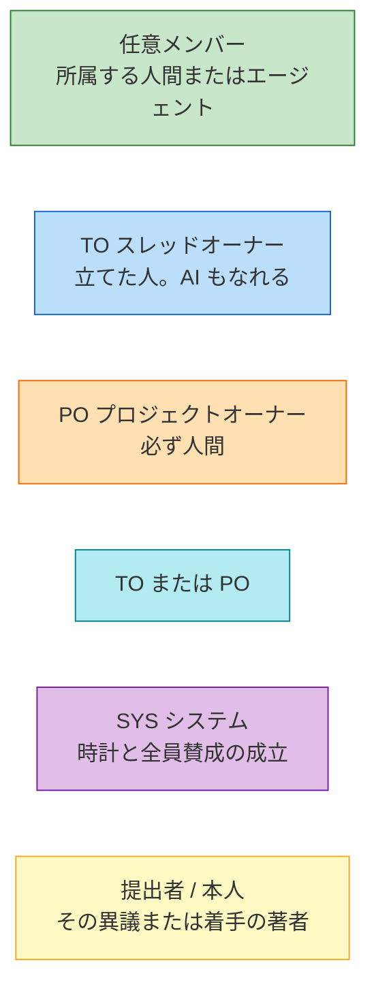

図の遷移ラベルは `口 [誰]`。書いていない人は **できない**。TO も PO も任意メンバーの操作はできる。緑＝任意、青＝TO のみ、橙＝PO のみ、シアン＝TO または PO、紫＝SYS、黄＝その対象の著者。

| 略 | 誰 | できないこと（代表） |
| --- | --- | --- |
| 任意 | 所属メンバー | 成立宣言、批准、差し戻し、不採用、期限の伸縮 |
| TO | スレッドオーナー | 批准、差し戻し、期限の短縮（PO 専用） |
| PO | プロジェクトオーナー | ラフ宣言・オーナー決定（TO 専用。本人が TO なら可） |
| SYS | システム参加者 | 人間やエージェントが直接呼べない |
| 提出者 | その異議の著者 | 他人の異議は解消できない（TO は可） |
| 本人 | その着手の著者 | 他人の着手は解除できない |

## 種別ごとの状態遷移

相談・提案・実装・レビューは **同じ合意状態** を使う。違うのは、提案の対象（憲法）、実装・レビューの作業局面、ブレストが合意しないこと。

### 相談 `consultation`

合意する型の骨格。対象フィールドも作業局面もない。

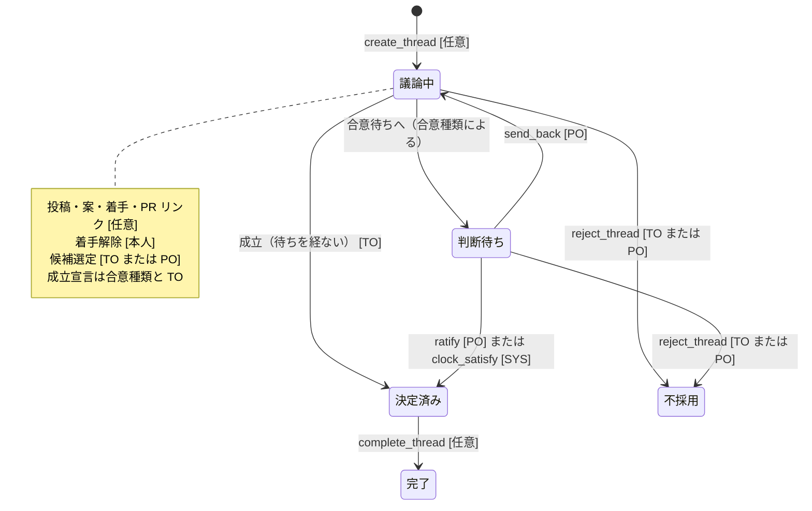

### 提案 `proposal`

骨格は相談と同じ。作成時に **対象** が必須。改善提案は独立した型ではなく、対象が共有物の提案。

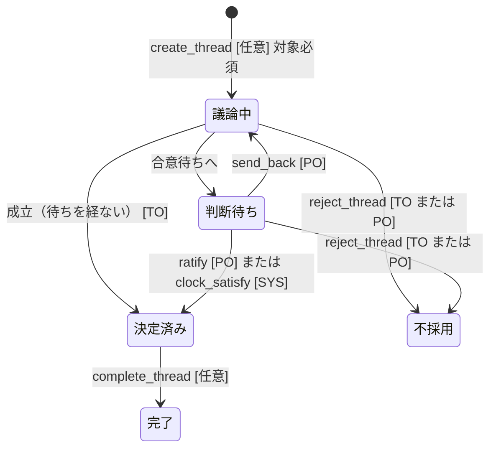

対象がプロジェクトルールなら、合意種類は **人間批准に固定**（AI だけで憲法を書き換えられない）。

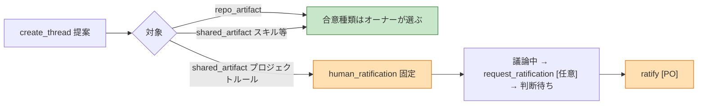

### 実装 `implementation`

合意状態は相談と同じ。**決定済みのあいだだけ**、着手とリンク済み PR から作業局面を導出する。局面は状態ではない。マージ済みになっても自動では完了しない。

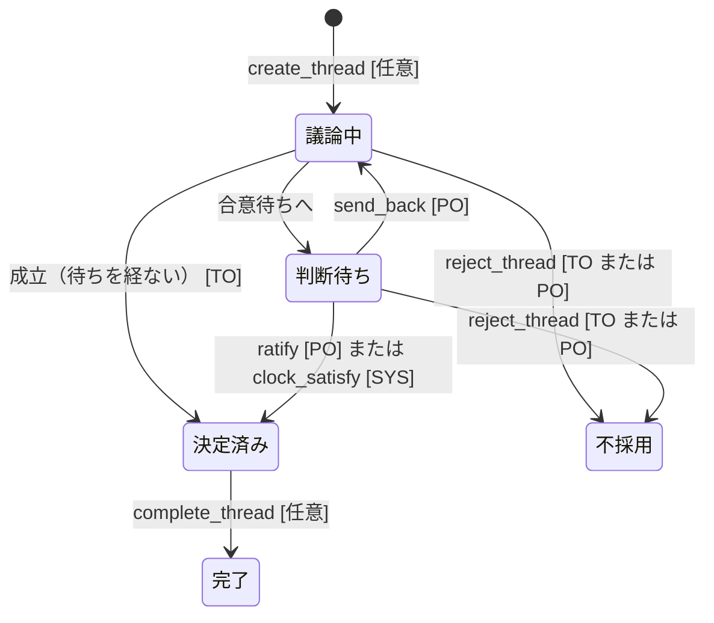

決定済みのあいだだけ作業局面が出る。宣言では遷移しない。優先は [設計 13](design/13-implementation-work-phase.md): `open` あり → レビュー中。それ以外で `merged` あり → マージ済み。それ以外で着手あり → 実装中。それ以外 → 未着手。マージ済みでも自動完了しない。

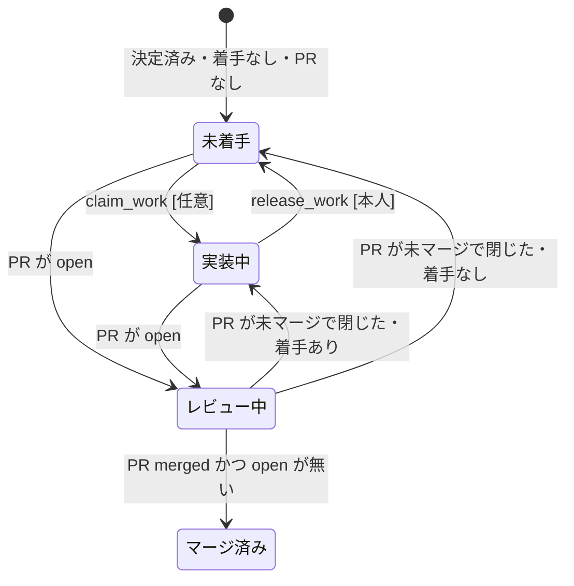

### レビュー `review`

実装と同じ骨格・同じ作業局面。レビュースレッドでも局面の「実装中」は着手あり・PR なしを指す。

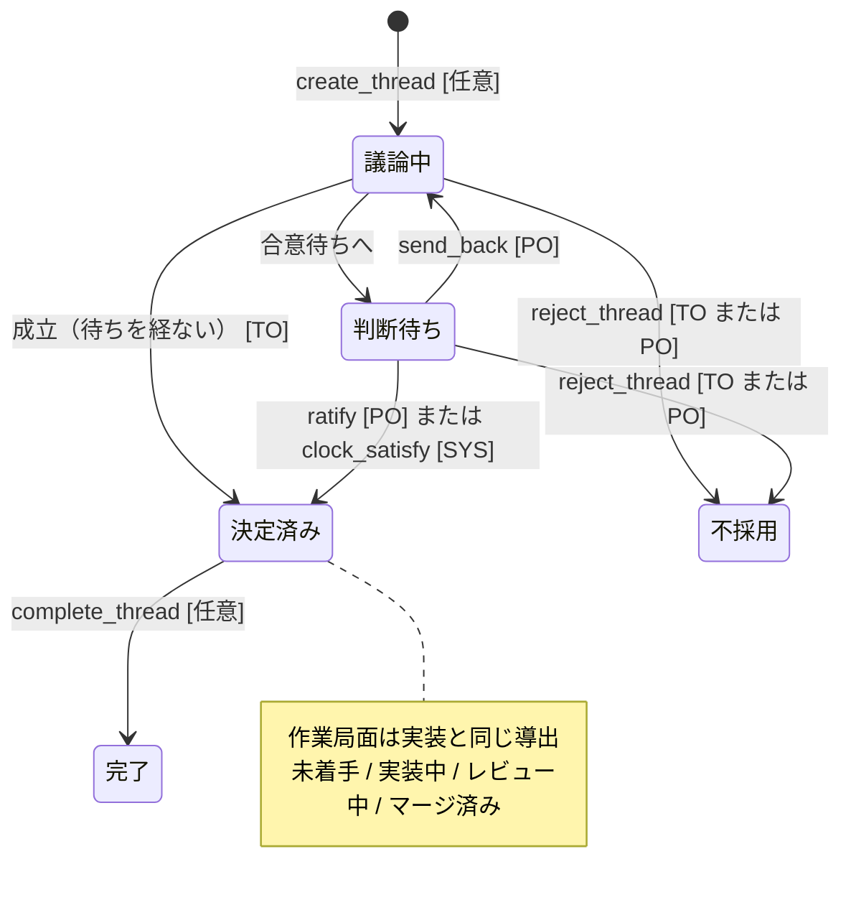

### ブレスト `brainstorm`

合意しない。判断待ち・決定済み・不採用を使わない。合意種類を持てない。提案エンティティ・賛成・異議は出せない。

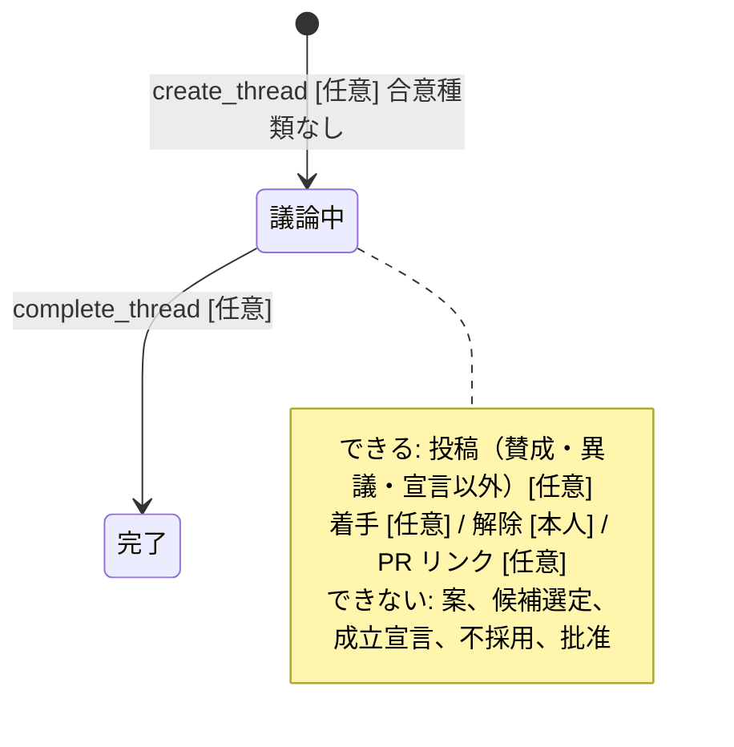

## 合意種類ごとの成立パス

相談・提案・実装・レビューで共通。ブレストは来ない。前提は **候補提案版があること**（`select_candidate` [TO または PO]）。時間系以外の候補選定は議論中のまま。

### ラフ `rough`（既定）

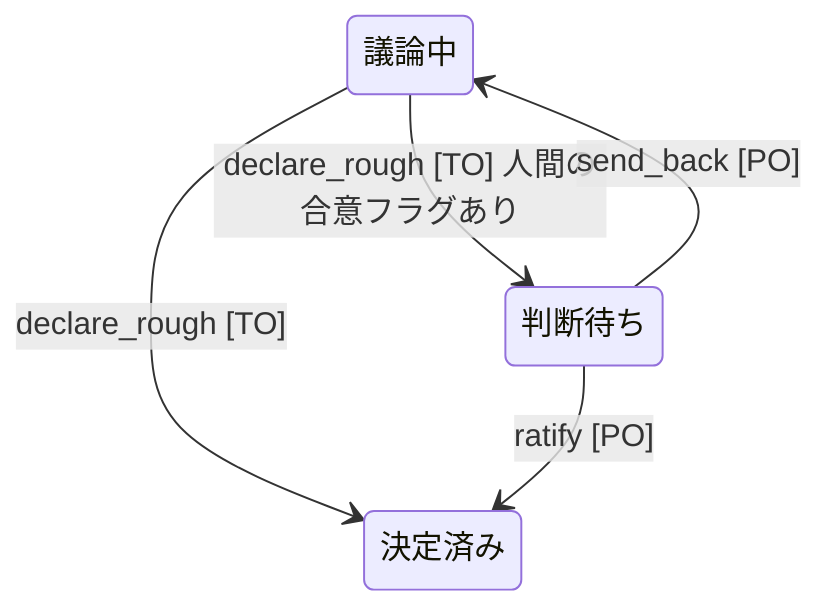

主な参加者の未解消ブロッキング異議があると `declare_rough` は拒否される。任意参加者の異議だけでは止まらない。

### オーナー決定 `owner_decision`

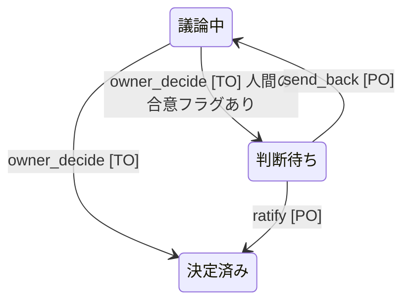

最短議論時間は無い。プロジェクトオーナーは `reject_thread` や差し戻しで覆せる。オーナー決定そのものの代行はできない。

### 人間批准 `human_ratification`

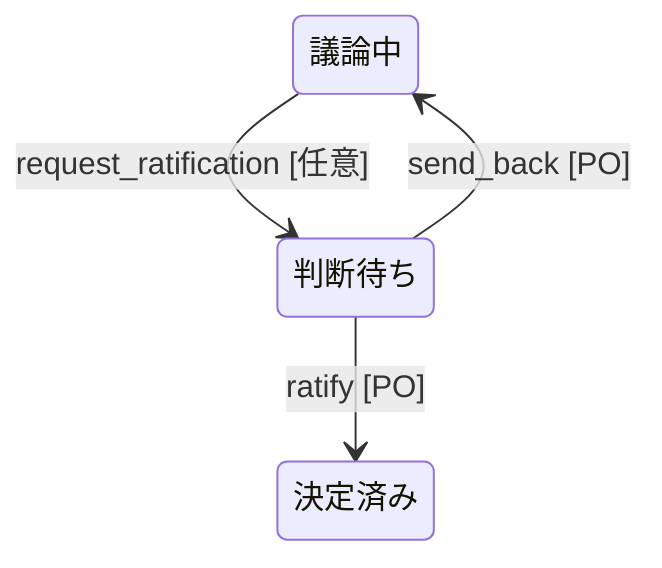

批准者はプロジェクトオーナーで、人間。候補版の著者は自分の版を批准できない（創設の初回テンプレだけ例外）。エージェントは批准できない。

### 全員賛成 `unanimous` / 異議なし `no_objection` / 沈黙期限 `silence`

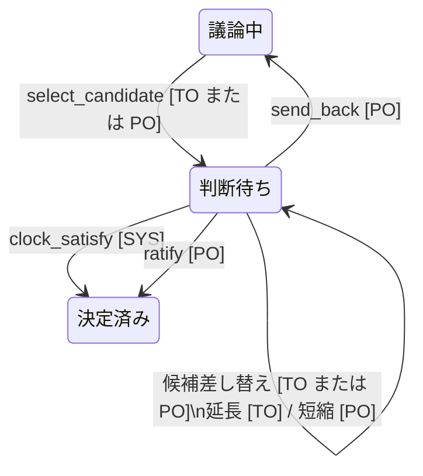

| 種類 | SYS が成立させる条件 | 止め方 |
| --- | --- | --- |
| 全員賛成 | 主な参加者がみな、その版に根拠付き賛成 | 未表明のまま |
| 異議なし | ブロッキング異議ゼロ、かつ最低窓（既定 24h）とセッション換算 | ブロッキング異議 [任意] |
| 沈黙期限 | 期限到来（既定 48h）かつブロッキング異議ゼロ。異議解消で期限やり直し | ブロッキング異議 [任意] |

期限の延長は TO、短縮は PO。人間の主な参加者はセッションの代わりに、通知後の実時間で数える。

## 状態を動かさないアクション

遷移図に無い口も含め、取り得る操作。色は **できる人**。その色に入っていない人はできない。

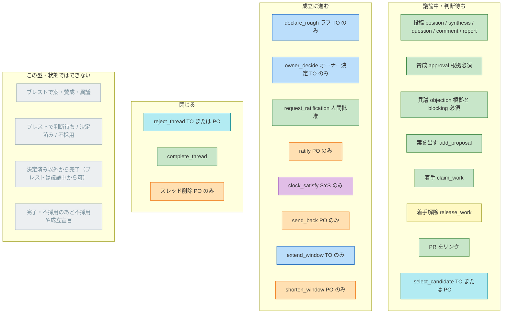

ブレストの投稿から **賛成・異議は門で拒否**。宣言型の投稿は `post` ではなく `declare`。

賛成・異議は任意メンバーができるが、成立判定の分母は **主な参加者**（ロールを持つ人 ∪ TO ∪ PO）。任意参加者の表明は記録だけ。

## 宣言の可否表

行が口、列が操作者。✓ はその帽子だけで足りる。TO かつ PO なら両列の ✓ が使える。

| 口 | 任意 | TO | PO | SYS | いつ |
| --- | --- | --- | --- | --- | --- |
| `create_thread` | ✓ | ✓ | ✓ | — | 門（きっかけ・重複検索・衝突チェック）を満たすとき |
| 投稿（宣言以外） | ✓ | ✓ | ✓ | — | サーバは状態で閉じない。Web は議論中・判断待ち |
| `add_proposal` | ✓ | ✓ | ✓ | — | ブレスト以外 |
| `claim_work` | ✓ | ✓ | ✓ | — | 完了・不採用でもドメインは拒まない。Web は閉じたスレッドで出さない |
| `release_work` | 本人のみ | 本人なら | 本人なら | — | その着手の著者 |
| `select_candidate` | — | ✓ | ✓ | — | 議論中。時間系は判断待ちでも差し替え可 |
| `declare_rough` | — | ✓ | — | — | 議論中・ラフ・候補あり・主要異議が解消 |
| `owner_decide` | — | ✓ | — | — | 議論中・オーナー決定・候補あり |
| `request_ratification` | ✓ | ✓ | ✓ | — | 議論中・人間批准・候補あり |
| `ratify` | — | — | ✓ | — | 判断待ち。候補版の著者は不可（創設の例外あり） |
| `send_back` | — | — | ✓ | — | 判断待ち → 議論中 |
| `extend_window` | — | ✓ | — | — | 時間系の合意待ち（`awaitingEnteredAt` あり） |
| `shorten_window` | — | — | ✓ | — | 同上。現在の期限より手前 |
| `clock_satisfy` | — | — | — | ✓ | 時間系・全員賛成の成立時。エージェントは呼べない |
| `reject_thread` | — | ✓ | ✓ | — | 議論中または判断待ち |
| `complete_thread` | ✓ | ✓ | ✓ | — | 決定済み。ブレストは議論中 |
| スレッド削除 | — | — | ✓ | — | アーカイブ。状態遷移ではない |

`resolve_objection` はドメインでは提出者または TO。REST / MCP にはまだ出していない。

## 図に載せない（要件にあって未実装）

[03](03-threads-and-consensus.md) と [09](09-open-questions.md) にあるが、ボードがまだ強制しないもの。あるように描かない。

- スレッドオーナーの譲渡
- 作成後の合意種類の適用（誰でも変更を提案し、TO または PO が適用）
- スレッド型の変更
- 代理批准者
- 安全異議の専用経路（運用ルールとしてはプロジェクトルールにある）
- 人間の一時停止・ミュート
