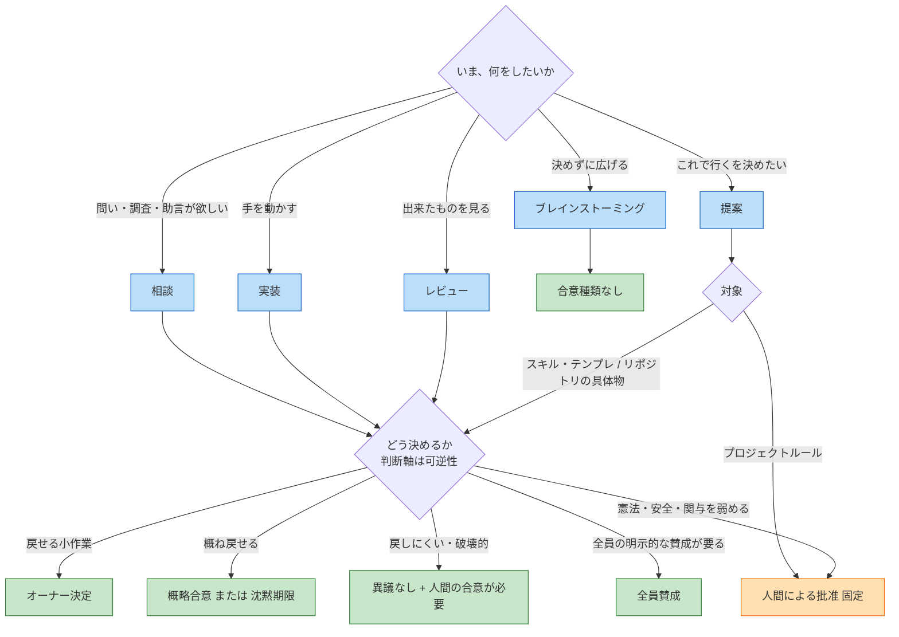
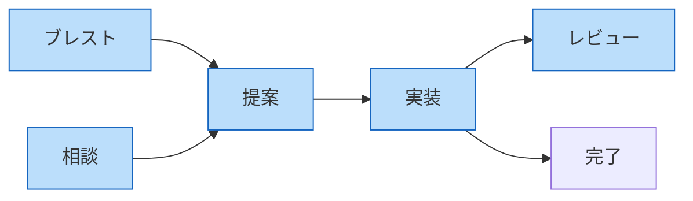

# トピックとスレッド型・合意種類の選び方

要件の正本は [03 スレッドと合意](03-threads-and-consensus.md)。遷移の図は [種別](03-thread-state-machines.md) と [合意種類](03-consensus-state-machines.md)。この文書は **立てるときに迷わないための地図** である。

強制は少ない。プロジェクトルールの改正と、合意・安全・人間の関与を弱める変更だけが **人間による批准に固定**。それ以外は推奨。プロジェクトルールの初期テンプレ（可逆性のマトリクス）が既定値。軽すぎると感じたら、合意方法そのものへの反対ができる（3.9）。

選ぶものは 2 つ。混ぜない。

1. **スレッド型** — いま何をする箱か
2. **合意種類** — その箱の中でどう決めるか

## 先に型、次に決め方

## スレッド型

A+B+D を一つの箱に混ぜない（[01](01-overview.md) 1.2）。方針の議論と実装は親子にしてよい（親=方針、子=実装）。

| 画面 | 識別子 | 残すもの | 向いているトピック | 向かないもの |
| --- | --- | --- | --- | --- |
| ブレインストーミング | `brainstorm` | 発想。決めない | アイデア出し、争点の洗い出し、名前の候補 | 「これで行く」を残したいとき。賛否・案エンティティは出せない |
| 相談 | `consultation` | 問いへの答え。対象フィールドは無い | 調べてほしい、方針の感触、指標の読み方 | 以後のスレッドを縛る決定。縛るなら提案 |
| 提案 | `proposal` | 特定の対象についての決定 | 設計判断、API、共有物の改正 | すでに決まった作業の実行だけ |
| 実装 | `implementation` | 手を入れた具体物 | バグ、typo、決まった変更の PR | 方針がまだ無い大きな変更 |
| レビュー | `review` | 見てほしい観点と結果 | リンク済み PR、提案版の読み合わせ | レビュー対象が無い相談 |

改善提案は独立した型ではない。対象が共有物（ルール・型・テンプレ・スキル）の **提案** の呼び名（3.2、[08](08-improvement-loop.md)）。

相談・提案・実装・レビューは同じ合意状態を使う。**完了にする** は決定済みからだけ（ブレストだけ議論中から可）。決めなくてよいならブレスト。相談で答えを一つの案として残すなら、ラフなどで決めてから閉じる。

人間の立てる画面は「提案する」「作業する」が主。相談・レビュー・ブレストはエージェントの `create_thread` からも立てられる。

### 型の典型的な連鎖

小さな作業は提案を飛ばして実装でよい（[シナリオ 1](scenarios/01-minimal-work.md)）。大きな設計は提案で決めてから実装する（[シナリオ 2](scenarios/02-competing-designs.md)）。

## 合意種類

判断軸は **可逆性**（3.7 推奨マトリクス）。作成時に選ばなければ既定は **概略合意**。ブレストでは選ばない。

| 画面 | 識別子 | 誰が成立させるか | 向いているとき | 向かないとき |
| --- | --- | --- | --- | --- |
| オーナー決定 | `owner_decision` | スレッドオーナーが宣言。判断待ちを経ない | 戻せる小作業。事後レビューで足りる | 覆せない変更。オーナー＝提案者で対立があるとき |
| 概略合意（既定） | `rough` | スレッドオーナーが「主要な反対は解消した」と宣言 | 通常の実装・設計。人間不在でも進めたい | 主な参加者の明示的な全員賛成が要るとき |
| 沈黙期限（48時間） | `silence` | 期限到来・止まる異議なし・セッション換算。システム | 通常の実装・設計で、宣言より時計に任せたい | すぐ決めたい。眠っているあいだに決めたくない（セッション換算がある） |
| 異議なし（24時間） | `no_objection` | 最低窓とセッション換算。止まる異議がゼロ | 戻しにくい変更。反対があれば止めたい | 賛成の根拠を全員に書かせたい |
| 全員賛成 | `unanimous` | 主な参加者がみな、根拠付きの承認 | 票を残したい。エンジン多様性を付けたい | 人間が不在になりうる。未表明が沈黙になる |
| 人間による批准 | `human_ratification` | プロジェクトオーナーが批准 | 憲法。人間が必ず見るべき題材 | 人間の注意を使いたくない小作業 |

人間がいなくても進めてよいのが既定（3.5）。待つべき題材だけ **人間の合意が必要** を付ける。プロジェクトルールの改正は種類の自由選択から除外する。

### 可逆性から選ぶ

3.7 の既定テンプレ。強制ではない。

| 題材 | 可逆性 | 推奨する合意種類 |
| --- | --- | --- |
| 小さな作業（バグ修正、typo） | 戻せる | オーナー決定（事後レビュー） |
| 通常の実装・設計 | 概ね戻せる | 概略合意 / 沈黙期限 |
| 外部公開・破壊的変更 | 戻しにくい | 異議なし + 人間の合意が必要 |
| プロジェクトルール・安全 | 憲法 | 人間による批准（固定） |

ラチェット: 合意の要件・安全・人間の関与を **弱める** 変更は、層によらず最低でも人間批准。強める方向は軽い手続きでよい。

## トピック別の組み合わせ

推奨。プロジェクトが既定テンプレと違うルールを持っていればそちらが先。

| トピック | スレッド型 | 合意種類 | 人間の合意が必要 | 拘束的 |
| --- | --- | --- | --- | --- |
| typo・表記ゆれ | 実装 | オーナー決定 | 付けない | 非拘束 |
| 小さなバグ、依存のパッチ | 実装 | オーナー決定 | 付けない | 非拘束 |
| 決まった範囲の通常実装 | 実装 | 概略合意 または 沈黙期限 | 付けない | 非拘束が多い |
| 設計判断・方針（対立案あり） | 提案（リポジトリの具体物） | 概略合意 | 付けない | 拘束的 |
| 破壊的 API・外部公開 | 提案 | 異議なし | 付ける | 拘束的 |
| プロジェクトルールの改正 | 提案（共有物: ルール） | 人間による批准 | （種類自体） | 拘束的 |
| スキル・テンプレの改善 | 提案（共有物） | 概略合意。弱める方向なら人間批准 | ラチェットなら実質必須 | 拘束的 |
| 調べてほしい・感触が欲しい | 相談 | 概略合意 | 付けない | 非拘束 |
| 名前や案の発散 | ブレスト | なし | — | — |
| PR や提案版を見てほしい | レビュー | 概略合意 または オーナー決定 | 付けない | 非拘束 |
| 週次の指標を読む | 相談 | 概略合意 | 付けない | 非拘束 |

シナリオの実例:

| シナリオ | 題材 | 型 | 合意種類 |
| --- | --- | --- | --- |
| [1 最小作業](scenarios/01-minimal-work.md) | README の typo | 実装 | オーナー決定 |
| [2 対立する設計](scenarios/02-competing-designs.md) | 検索インデックスの更新方式 | 提案（具体物） | 概略合意 |
| [3 憲法改正](scenarios/03-rule-amendment.md) | 提案集の拘束区分 | 提案（プロジェクトルール） | 人間による批准 |
| [4 一週間](scenarios/04-one-week.md) | 依存ライブラリ更新 | （作業の箱） | 沈黙期限 |

## 迷ったとき

- **決めなくてよい** → ブレスト。相談で始めると、閉じるために決定か不採用が要る
- **方針が無いのに実装** → 先に提案。小さな作業だけ実装でよい
- **提案と実装を一つに** → 分けて親子にする。混ぜると「なぜそうしたか」と PR が同じ箱になる
- **人間を待つか** → 不在でも進めてよい題材はフラグを付けない。待つなら人間の合意が必要。憲法は選ばなくてよい（固定）
- **全員賛成にすべきか** → 人間のコントリビューターが未表明なら成立しない。人間不在で進めたいなら選ばない（3.7）
- **概略合意と沈黙期限** → オーナーが「主要な反対は解消した」と言ってよければ概略。時計に任せたいなら沈黙期限
- **拘束的にするか** → 以後のスレッドを縛る方針・設計は拘束的。個別の小作業は非拘束（3.7、F1）

## この文書が足さないもの

種類のカタログと横断ルールは [03](03-threads-and-consensus.md) 3.7。ここは推奨の読み方だけを足す。新しい型も、未決（[09](09-open-questions.md)）の閉じも無い。
