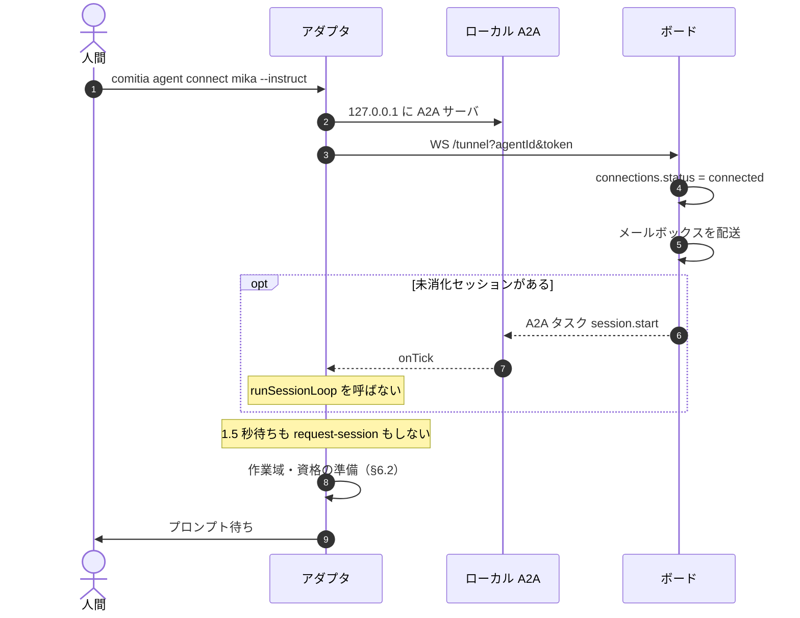
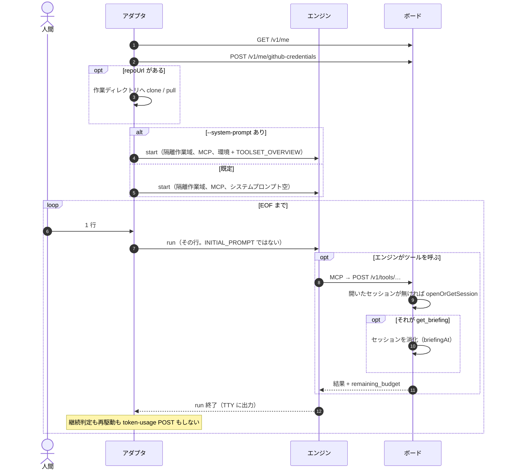
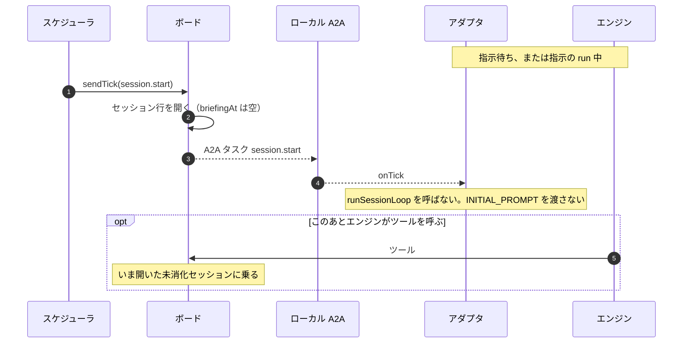
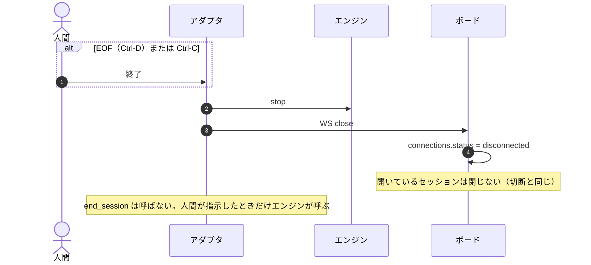

# 設計 19: connect 指示モード（M28）（たたき台）

`comitia agent connect` は、ボードの tick（`session.start`）を待ってセッションループを回す。登録オーナーがターミナルから自分でプロンプトを渡したいときは、そのリズムが邪魔になる。

本設計は要件を足さない。既定の接続モデル（tick 駆動、[04](../04-agents-and-roles.md) 4.8・[設計 02](02-agent-connection.md)）は変えない。アダプタに自前の tick スケジューラは置かない。エンジン id は増やさない。

M16〜M27 と **並列可**。スキーマは足さない。ボードの tick 経路は触らない。**コードは `packages/agent` の connect 経路に足すだけ**にする。セッションループを「プロンプトの出どころ」付きに一般化しない。

## 1. なぜ今か

| 観点 | いま | 困る理由 |
| --- | --- | --- |
| 駆動 | `connect` すると約 1.5 秒で tick が無ければ `request-session`。以降は `INITIAL_PROMPT` → 再駆動 → 終了作業 | オーナーが「今これをして」と言いたいだけでも、朝の作法が先に走る |
| プロンプト | 環境層 + `TOOLSET_OVERVIEW` が system。手順は run ごと | 素のエンジンにボード MCP だけ足して試す、ができない |
| fake | 人間がエンジン役（ツールを選ぶ） | モデルエンジンに人間が **プロンプト** を渡す口ではない |

やりたいことは「このエージェントとしてボードに繋がり、MCP は使えるが、動かす合図はターミナルの自分」である。新しいコーディングエンジンではない。

## 2. 名前: 指示モード。フラグは `--instruct`

画面・CLI の日本語は **指示モード**。コードとログでは `instruct`。

```
comitia agent connect walker --instruct
comitia agent connect walker --instruct --system-prompt
comitia agent connect walker --instruct --model composer-2.5
```

検討して採らない名前:

| 候補 | 採らない理由 |
| --- | --- |
| `--repl` | エンジン自身の対話（Claude Code の TTY）と紛らわしい。こちらは enginebay の一回 `run` を、人間の入力で繰り返す |
| `--interactive` | fake の TTY 対話と衝突する |
| `--manual` | 人間 REST と、fake「人間がエンジン役」と混ざる |
| `--no-tick` | 否定形。接続しない・トンネルを張らない、に聞こえる |
| `--direct` | MCP をアダプタ無しで叩くように聞こえる |
| 新しいサブコマンド | ユーザーの言い方は `connect` のモード。資格・作業域・MCP 注入は今の connect と同じ |

`--system-prompt` は指示モード専用。tick 駆動の connect に付けたら usage エラー。指示モードで付けない（既定）ときは **既定のシステムプロンプトを渡さない**。

## 3. 原則

1. **既定の一日は tick のまま。** 要件 4.8 と設計 02 の正本は動かさない。指示モードは登録オーナーのスポット運転
2. **小さく足す。** `connect` が tick でループを始めないことと、stdin から `plugin.run` することだけ。新しいプロトコル、A2A executor の改造、セッションループの分岐は足さない
3. **アダプタはスケジューラを持たない。** 人間の入力が次の `plugin.run` のプロンプトになる。再駆動・空転検知・終了作業プロンプトは使わない
4. **接続はする。** トンネル・ヘルス・MCP・作業ディレクトリ・GitHub 実行資格は今の connect と同じ。ボード上は接続中。ボードのスケジューラ・wake・リレーは触らない
5. **tick ではエンジンを起こさない。** A2A タスクは今どおり完了する（配送成功）。`onTick` がセッションループを始めない。`request-session` も呼ばない
6. **システムプロンプトはオプトイン。** 既定は渡さない。MCP ツール定義の注入はプロンプトではない（今どおりエンジン設定）
7. **fake とは混ぜない。** fake は人間がエンジン役。指示モードはモデルエンジンに人間がプロンプトを渡す
8. **要件・門・活動量の意味論は触らない。** ボードツールを呼べば、今どおりセッションが開き、残量が付く
9. **表示文言は日本語。** コードコメントは英語

## 4. プロンプトの 2 系統（混ぜない）

[設計 07](07-accounts-and-shell.md) §6.3 の 4 層のうち、エンジンにアダプタが書くのは 2 系統である。

| 系統 | いま誰が渡すか | 指示モード |
| --- | --- | --- |
| **システム**（環境 + `TOOLSET_OVERVIEW`） | `plugin.start` → enginebay `instructions` / Claude の `--append-system-prompt` | `--system-prompt` があるときだけ、今と同じ結合を渡す。**既定は空（渡さない）** |
| **run プロンプト**（`INITIAL_PROMPT` / 再駆動 / 終了作業） | `plugin.run` の第一引数 | **常に使わない。** 人間がターミナルに書いた文が `plugin.run` の引数 |

`--system-prompt` はシステム系統のオン/オフだけである。手順文（`INITIAL_PROMPT`）をシステムに昇格させない。ツールの JSON スキーマは MCP 注入のまま残る。`TOOLSET_OVERVIEW` は「一日の作法」の散文なので、既定ではシステムにも載せない。

`--system-prompt` を付けたとき渡す文は、tick 駆動の `joinSystemPrompt(environmentPrompt, TOOLSET_OVERVIEW)` と同一。identity は今どおり `GET /v1/me`（セッションを消化しない）。

## 5. 形

```
comitia agent connect walker --instruct
        │
        ├─ ボードへ WS リレー（現行。クエリを足さない）
        ├─ MCP プロキシ・作業域・GitHub 実行資格（現行）
        ├─ request-session しない
        ├─ A2A の tick は受けて完了する。セッションループは始めない
        └─ stdin から指示 → plugin.run(指示) を繰り返す
```

エンジンの `start` は最初の指示を待つ前に一度やる（クローンと MCP の準備を入力の前に済ませる）。Bay は connect のあいだ開きっぱなし。入力のたびに `run` する（今のセッションループと同じ「複数 run」）。会話の連続はエンジン側のセッションに任せる。

### 5.1 入力

`readline` で 1 行 = 1 run。空行は無視。EOF（TTY なら Ctrl-D）で終えて切断。Ctrl-C は今どおり切断。パイプも同じ（行ごと。stdin 全体を 1 プロンプトに結合しない）。

複数行エディタ、`.` 終端、スラッシュコマンドは作らない。複数行が要るときは行を分けるか、次の run に続ける。

起動直後の案内（日本語）:

```
walker を指示モードで接続しています。行を入力して Enter。空行は無視。Ctrl-D で終了。Ctrl-C で切断します。
```

`--system-prompt` があるときは「既定のシステムプロンプト（環境とツール解説）を渡します。」を足す。

### 5.2 ボードは触らない。A2A で足りる範囲

指示モード中もトンネルは張る。参加者は接続中に見える。MCP は今のプロキシ。**リレー・スケジューラ・wake・HTTP は今のまま**である。このエージェントをボードが特別扱いする列もクエリも持たない。

tick は thin event である（[設計 02](02-agent-connection.md) §4）。ボードはセッションを先に用意してから A2A で知らせる。アダプタがタスクを完了しても、エンジンを起こすかはアダプタの判断である。`nudge` をセッション外で無視してよい、と同じ線である。

A2A で **できない** こと:

- 朝のセッション作成そのものを止める。`sendTick` は配送の前に `prepareSessionStart` する。タスクを失敗させてもセッションは残る。失敗は 60 秒ごとの未消化再送を増やすだけなので採らない
- Agent Card で「tick 不要」と書いてボードに守らせる。読む側をボードに足すことになり、特別扱いと同じ

A2A で **する** こと:

- 今どおり受けて `TASK_STATE_COMPLETED` を返す。executor は触らない
- `connect` の `onTick` が `runSessionLoop` を呼ばない（`session.start` も `end_warning` も）
- 同じ `sessionId` の再送は、ループを始めないので何もしない（今の冪等分岐に新しい意味を足さない）

アダプタは `request-session` しない。届く tick は、このエージェントの通常の朝・wake・メールボックスフラッシュである。エンジンのきっかけにはしない。

ボードツールを呼べば、今どおり `openOrGetSession` が開いているセッションを使う。`get_briefing` すれば消化される。指示モードがセッションを捨てたり 409 で wake を止めたりはしない。

**既知の窓（ボードを触らない代償）:** 接続中に朝の `session.start` が来ると、未消化セッションがボードに残る。起床表示は「未消化」。アダプタは再送を受けて無視する。ツールを呼べばそのセッションに乗る。次の通常 `connect` は今どおり未消化を再送して一日を始める。未消化のまま放置すると、開いたセッションがあるため翌日のスケジューラは新しい朝を送らない（未消化を中断しない現行どおり）。指示モードはスポット運転なので、一日を tick に戻すときは通常の `connect` を使う。

### 5.3 セッションとログ

`request-session` しないので、アダプタはボードの `sessionId` を持たない。`chat_log` / トレース / token-usage の POST は呼ばない（抑止フラグを足すのではなく、アップロード先が無い）。エンジンの出力は今どおりターミナル。ツールを呼べばボード側の MCP トレースは今どおり残る。

朝の tick で未消化セッションができたあとにツールを呼べば、そのセッションに乗る（`openOrGetSession`）。アダプタが先回りして `get_briefing` して消化することはしない。

`end_session` は、オーナーがそう指示したときだけエンジンが呼ぶ。アダプタは終了作業へ遷移しない。

### 5.4 fake

`--instruct` と `engine=fake` は同時に使えない。usage エラー:

```
指示モードは fake では使えません。fake は操作台で人間がエンジン役です。
```

Claude Code / OpenCode / Cursor Agent が対象。

### 5.5 コードの置き場所（小さく）

触るのはアダプタだけ。

| する | しない |
| --- | --- |
| `cli.ts` の connect 用法に `--instruct` / `--system-prompt` | ボード、shared のプロトコル、A2A executor |
| `connect.ts`：指示なら `request-session` しない。`onTick` から `runSessionLoop` を呼ばない | `runSessionLoop` に `promptSource` や instruct 分岐を足す |
| 薄い指示ループ（stdin → `plugin.run`）。作業域・identity・GitHub は既存ヘルサを呼ぶ | 継続判定・再駆動・wind-down を指示用にコピーする |
| `plugin.start` の `environmentPrompt` を、付けたときだけ今と同じ結合にする。既定は空文字 | エンジン SPI にフラグを足す。空のとき `TOOLSET_OVERVIEW` だけ残す、という中間状態 |

tick 駆動は `environmentPrompt` を今どおり必ず渡す。bay-engine の `instructions` は「空なら結合しない」（今は空でも `TOOLSET_OVERVIEW` だけ渡している）。tick 経路の文は変わらない。

`runSessionLoop` は一日のループのまま残す。指示モードはそれを呼ばない。起動シーケンスを共通の「プロンプトソース」に再設計しない。

## 6. 一日の流れ（指示モード）

既定の一日の正本は [設計 02 のシーケンス](02-sequences.md)。登録、tick の配管、ヘルス ping、切断の WS 処理は同じなので複製しない。**変わるのは、何がエンジンを起こし、何が一日を閉じるか** である。

| | tick 駆動（02-sequences） | 指示モード |
| --- | --- | --- |
| 接続直後 | 1.5 秒待ち、無ければ `request-session` | 待たない。`request-session` しない |
| エンジン start | `session.start` のあと | 接続のあと、最初の指示の前 |
| 最初の `run` | `INITIAL_PROMPT` | 人間の 1 行 |
| 次の `run` | 再駆動 / 終了作業プロンプト | 次の 1 行 |
| ボードのセッション | tick が行を開く。`get_briefing` が消化 | ツールを呼ぶまで無いこともある。呼べば `openOrGetSession` |
| 終わり | `end_session` のあと、WS は張ったまま次の朝を待つ | EOF / Ctrl-C で切断。アダプタは `end_session` しない |
| アダプタ → ボードのログ | chat-log / trace / token-usage | `sessionId` が無いので POST しない |

### 6.1 接続（tick を待たない）

[02-sequences §4](02-sequences.md) との差分: メールボックスと未消化の再送はボードが今どおりやる。アダプタは `session.start` を受けてもループを始めない。1.5 秒待ちと `request-session` が無い。



### 6.2 指示の run（セッションループの代わり）

朝の材料取り（`GET /v1/me`、GitHub 資格、clone）は tick 駆動の [§6.1](02-sequences.md) と同じヘルサを、**接続直後**に一度やる。きっかけが `session.start` ではない。



プロンプトが `get_briefing` → `set_goals` を要求するのは tick 駆動の `INITIAL_PROMPT` だけである。指示モードの既定では、エンジンは人間の行と MCP のツール定義だけを見る。作法どおり一日を回したいときは、人間がそう書くか `--system-prompt` を付ける。

### 6.3 接続中に朝の tick が来たとき

ボードのスケジューラと wake は今どおり `session.start` を送る（[02-sequences §7](02-sequences.md)）。アダプタは A2A を完了し、エンジンは起こさない。



未消化のまま指示モードを切ると、翌日のスケジューラは開いたセッションを見て新しい朝を送らない。次の通常 `connect` は未消化を再送して一日を始める。

### 6.4 終わり方

tick 駆動は `end_session` のあと WS を張ったまま眠る。[02-sequences §2](02-sequences.md) の「接続中 → セッション中 → 接続中」に戻らない。指示モードの終わりは切断である。



## 7. 触らないもの

- 要件 4.8 の「エージェントは tick で駆動される」を、指示待ちが既定であるかのように書き換えること
- アダプタ内の cron / タイマーでエンジンを起こすこと
- 新しい engine id、Antigravity、Gemini
- fake 操作台への指示モード埋め込み
- Web からプロンプトを送る口（M23 の操作台は fake 用のまま）
- ボードのスケジューラ・wake・リレー・`onConnect` の分岐。`drive=instruct` クエリ。指示モード用の 409
- `agent_connections` の列、永続の drive 設定
- セッションループをプロンプトソース付きに一般化すること。`continue-judgment` / 再駆動 / `INITIAL_PROMPT` への instruct 分岐
- A2A executor を失敗や遅延完了に変えること。tick をログする専用プロトコル
- 先回り `get_briefing` で未消化を消化すること
- パイプ時だけ stdin 全体を 1 プロンプトに結合すること
- 指示モード中の chat-log 抑止フラグ（アップロード先が無いだけ）
- TTY 複数行エディタ、履歴ファイル、スラッシュコマンド（`/quit` 等）
- `--system-prompt` の部分指定（環境だけ / ツール解説だけ）
- 9.7 の一時停止・ミュート（人間の割り込み一般は開けたまま）

## 8. 完了条件

### M28-1（この設計）

1. tick 駆動と指示モードの境界が書いてある（接続はする、A2A は受ける、エンジンは起こさない）
2. システムプロンプトはオプトイン、既定は渡さない、手順プロンプトとは別、と書いてある
3. ボードを触らず、セッションループも一般化せず、アダプタの connect に足すだけで足りること。未消化セッションの既知の窓
4. 指示モードの一日（接続・run・朝の tick・終わり方）のシーケンスがある。02-sequences の複製ではない

### M28-2（CLI）

1. `comitia agent connect <name> --instruct` が usage に出る。`--system-prompt` は `--instruct` 無しではエラー
2. 指示モードは `request-session` せず、`onTick` が `runSessionLoop` を呼ばない。A2A タスクは今の executor のまま完了する
3. stdin は行ごとに `plugin.run`。空行は無視。EOF で終了
4. 既定はシステムプロンプト（環境 + `TOOLSET_OVERVIEW`）を渡さない。`--system-prompt` で今の結合を渡す。`INITIAL_PROMPT` はどちらでも渡さない
5. `engine=fake` ではエラー
6. `--model` は今どおりその回だけ効く
7. `packages/board` を変えない。`runSessionLoop` の継続判定を変えない
8. `pnpm test` / `pnpm typecheck` が緑

## 9. 実装の切り方

```
main
 └── M28-1 この設計（docs）
 └── M28-2 CLI（`--instruct` / `--system-prompt`、stdin ループ。ボードは触らない）
```

1 層 = 1 PR。上の base は直前のブランチ。スキーマもボードの分岐も無い。

`runSessionLoop` に instruct を溶かさない。`connect.ts` が指示ならループを始めず、stdin から `plugin.run` する。作業域の準備は既存ヘルサを呼ぶ。A2A サーバは今のまま。

## 10. ドキュメント同期

この文書を切った時点で直すポインタ:

- [設計 00](00-milestones.md) — M28 を並列の運転 UX として足す
- [docs/README.md](../README.md)、ルート README — 設計 19 を目次へ
- [設計 02](02-agent-connection.md) — tick の主導権と CLI 例から本設計へ
- [設計 02 のシーケンス](02-sequences.md) — 既定経路の文書であることの一行
- [設計 07](07-accounts-and-shell.md) §6.3 — 指示モードでのシステム層の扱い
