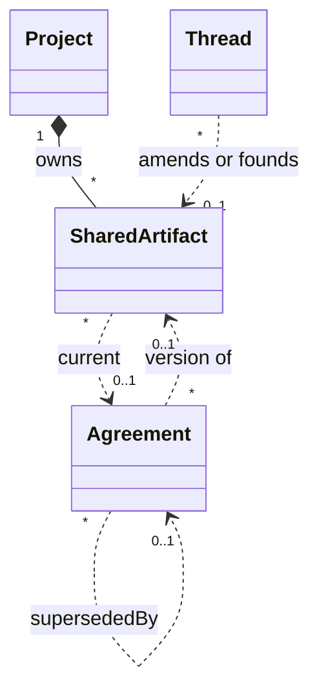

# 設計 21: 共有物の構造と管理（M30）（たたき台）

共有物（プロジェクトルール・スレッドテンプレ・スキル）は、合意の副作用として「その kind の最新行」を読んでいる。改正しても旧合意は有効のまま残り、置換リンクが付かない（[#148](https://github.com/hskksk/comitia/issues/148)）。スキルは複数本が並ぶ前提なのに、kind 単位で畳むと「新しいスキルの追加」と「既存スキルの改正」が区別できない。

本設計は要件を足さない。[03](../03-threads-and-consensus.md) 3.11 の「古い決定の無効化は新しいスレッドの合意で行う」と、[08](../08-improvement-loop.md) の層（憲法 1 件 / 手順は複数）を、共有物の **identity** として実装に落とす。Issue が提案した「同じ kind の直前 active を `supersedeAgreement` する」は採らない。

M16〜M29 と **並列可**。ただし [設計 09](09-layer3.md) の M17 改正門は「その kind に有効合意が 1 件ある」と書いてあり、本設計の identity と衝突する。**M17 の実装は M30-2 のあと**。効果列（`expected_effect` / `review_at`）は本マイルストーンで先取りしない。

## 1. なぜ今か

[#148](https://github.com/hskksk/comitia/issues/148) はバグ報告だが、直す単位が「合意の後処理」では足りない。共有物がエンティティとして存在しない。

| 観点 | いま | 困る理由 |
| --- | --- | --- |
| 正本 | `agreements` のうち `state=active` かつ `outcome=adopted` を、スレッドの `sharedArtifactKind` で絞る。憲法 kind は `createdAt desc limit 1` | 複数 active が並存してよい。どれが現行かは時刻。置換の記録が無い |
| 改正 | 新しい提案スレッドを立て、新しい合意を足す。`recordAgreement` は旧合意を触らない。`supersedeAgreement` はプロジェクトオーナー専用で、本番パスから呼ばれない | 3.11 の「置換済み」が共有物では空。`decision_view.previousAgreement` は常に null（#148） |
| スキル | 同じ kind の有効採用をすべて現行とみなす | 2 本目のスキル採用が、1 本目の改正にも、別スキルの創設にも見える。kind 単位の supersede は 1 本目を消す |
| ラチェット | テンプレに「弱める方向か」と書いてある。新旧本文を機械的に並べる口が無い | 批准者は全文の目視突き合わせだけ。判定者自体は 9.9 の未決のまま |
| M17 | 改正 = 「その kind の有効合意がすでに 1 件」 | スキルの 2 本目創設が改正扱いになり、期待効果門が誤爆する |

同じ論争を毎週起こさないための提案集（3.11）が、憲法と手順については「いま効いている文書」を持てていない。読み取り（[設計 16](16-agent-read-parity.md) M25）は採用済み本文を返せるようになったが、**どの文書のどの版か** はまだ kind と時刻である。

## 2. 要件との関係

| 残す | 変える（実現だけ） |
| --- | --- |
| 改善提案は独立したスレッド型ではない。対象が共有物の提案（3.2） | 共有物に identity を付ける。スレッドはその版を決める場 |
| 古い決定の無効化は元スレッドを再開せず、新しいスレッドの合意で行う（3.11） | 成立時に、対象文書の現行合意を `superseded` にする。オーナー特権の手動置換ではない |
| 憲法（プロジェクトルール）は人間批准固定。テンプレとスキルは層が軽い（8.1、3.7） | 憲法 kind はプロジェクトあたり有効 1 文書。スキルは識別名ごとに 1 文書、複数並ぶ |
| ラチェットの「弱める方向を誰が判定するか」は 9.9 の未決 | 判定者を決めない。現行本文と候補本文の diff を出すところまで |
| 改正の効き始め（翌セッションか）は 9.9 の未決 | 朝のパックは現行ポインタを読む、のまま。新しい時計は足さない |
| カタログ（`list_system_templates`）と採用済みを混ぜない（設計 16） | 採用済みの口は SharedArtifact の現行合意を返す |
| 合意物の状態 active / superseded / revoked（3.11） | 共有物の改正は superseded を使う。revoked（置換なし失効）は本マイルストーンでは触らない |

要件ドキュメントに新しい層やスレッド型は足さない。概念の親として **共有物** を [02](../02-concepts.md) に一行置く（ルール・テンプレ・スキルは種類）。

## 3. 調査結果（実装の事実）

| 口 | 中身 |
| --- | --- |
| `threads.sharedArtifactKind` | `project_rule` / `thread_template` / `skill`。文書 id は無い |
| `getActiveSharedArtifact` | 憲法 kind だけ。`agreements.state=active` を `createdAt desc limit 1` |
| `listSharedArtifacts` | 憲法は最新 1、skill は active 全件。どれも「合意行」であり文書ではない |
| `recordAgreement` | insert だけ。旧行を `superseded` にしない |
| `supersedeAgreement` | `assertProjectOwner`。テストと seed reset 以外から呼ばれない |
| `getDecisionView.previousAgreement` | `supersededByAgreementId = この合意` を辿る。共有物改正では常に null |
| `adoptFoundingArtifact` | 憲法 kind に active が無いときだけ通る。文書行は作らない |
| 創設門 | ルールとテンプレの「有無」は `hasActiveSharedArtifact`。同じ関数の limit 1 |
| M11 | 同一提案の前版 diff はある。**別スレッドの旧合意** との本文 diff は置換リンク前提で、共有物では空 |

Issue の再現（創設 → 改正批准 → 旧合意が active のまま、`previousAgreement` が null）は、この表どおりである。

## 4. 原則

1. **kind は種類であり、文書ではない。** 同じ kind の合意を時刻で畳まない。スキルは複数文書、憲法は種類あたり 1 文書
2. **現行はポインタである。** `createdAt` の最大値で決めない。`SharedArtifact.currentAgreementId` が正
3. **改正は新しいスレッド。** 創設スレッドを再開しない（3.11）。スレッドは `sharedArtifactId` で対象文書を指す
4. **成立が置換を起こす。** 新しい合意の記録と同じトランザクションで、対象の現行合意を `superseded` にする。認可は「そのスレッドの合意が成立したこと」。プロジェクトオーナーであることは不要
5. **本文の正本は採用された提案版のまま。** 共有物テーブルに content を複製しない。現行合意 → `proposalVersions.content`
6. **創設と改正を門で分ける。** 改正は既存文書への参照が必須。憲法 kind の 2 件目創設は 400。スキルの 2 件目は新しい識別名なら創設、既存 id なら改正
7. **ラチェットを自動判定しない。** 9.9 を閉じない。diff を批准の材料にする
8. **M17 の列を先取りしない。** 改正の定義だけ本設計に合わせ、期待効果・見直し日は設計 09 のまま
9. **具体物の合意は触らない。** `repo_artifact` の衝突引用 → 自動置換は別スライス。本マイルストーンは共有物だけ
10. **UI ライブラリを足さない。** 表示文言は日本語。コードコメントは英語

採らない案:

| 案 | 採らない理由 |
| --- | --- |
| 同じ kind の直前 active を supersede（#148 の提案） | スキルの追加が既存スキルを消す。文書が無い |
| 憲法もスキルも「最新 1 件」 | 手順メモリが 1 本に潰れる。8.1 と設計 16 の cardinality に反する |
| 創設スレッドを再開して版を足す | 3.11 が禁じる。議論の場と文書の寿命を混ぜる |
| 共有物テーブルに本文を持つ | 提案版が正本でなくなる。採用されていない草稿と現行が二重管理になる |
| 弱める変更をサーバが分類して人間批准に上げる | 9.9。誤判定が門になる |

## 5. モデル

実装の所有図の正本は、スキーマを足す PR で [設計 14](14-board-domain-model.md) を直す。ここでは足す関係だけを固定する。



**`shared_artifacts`（新）**

| 列 | 内容 |
| --- | --- |
| `id` | uuid |
| `project_id` | 所有 |
| `kind` | `project_rule` / `thread_template` / `skill` |
| `key` | プロジェクト内・kind 内の識別名。憲法は kind と同値（`project_rule` / `thread_template`）。スキルは創設時に付ける slug |
| `current_agreement_id` | 現行の採用合意。創設スレッドがまだ決まっていないあいだは null |
| `created_at` | |

unique `(project_id, kind, key)`。憲法 kind の key は固定なので、結果として憲法はプロジェクトあたり kind 1 行。

状態列は足さない。現行が無い行は、創設スレッドが不採用になったあと残さない（§7.3）。失効（revoked）で文書を畳むのは開けたまま。

**スレッド**

| 列 | 内容 |
| --- | --- |
| `shared_artifact_id` | 改正する既存文書、または創設が決まったあとの文書。創設中でまだ合意が無いときは null |
| `shared_artifact_key` | スキル創設のときだけ。採用時に文書を作る材料。憲法は使わない（key = kind） |

`sharedArtifactKind` は残す（検索と創設門）。文書 id と矛盾したら 400。

**合意**

| 列 | 内容 |
| --- | --- |
| `shared_artifact_id` | この合意がその文書の一版であること。検索用の複製。所有の親は増やさない（設計 14 の `project_id` と同じ） |

`superseded_by_agreement_id` と `state` はいまのまま。共有物の改正では必ず埋める。

本文は持たない。読むときは現行合意の `proposalVersionId` を join する（いまの `listActiveAdoptedArtifacts` と同じ結合先）。

## 6. カーディナリティ

| kind | 有効な SharedArtifact | 1 文書の現行合意 |
| --- | --- | --- |
| `project_rule` | プロジェクトあたり 0 または 1 | 0 または 1（ポインタ） |
| `thread_template` | 0 または 1 | 0 または 1 |
| `skill` | 0 件以上（key ごと 1） | 文書あたり 0 または 1 |

「有効」= 行が存在し、`current_agreement_id` が非 null。創設門（ルールとテンプレが揃うまで他スレッドを立てられない）は、この 2 つの現行ポインタの有無で見る。`createdAt desc limit 1` は捨てる。

スキルの key:

- パターン: `^[a-z0-9]+(?:-[a-z0-9]+)*$`
- 長さ 1〜64
- 表示名は現行合意の `summary`（人間が読む題）。key はツールと unique 用
- カタログ id（`list_system_templates` の `default` 等）とは別物。skill にシステムカタログは無い（設計 16 のまま）

## 7. 創設と改正

### 7.1 起票

提案スレッド `target=shared_artifact` のとき:

| 意図 | 入力 | サーバ |
| --- | --- | --- |
| 憲法の創設 | `kind` のみ。その kind の文書がまだ無い | 通す。`shared_artifact_id` はまだ無い |
| 憲法の改正 | `kind` + 既存 `shared_artifact_id` | 文書の kind が一致。現行合意が必須。衝突引用に現行合意を含める |
| 憲法の 2 件目創設 | `kind` のみで、文書が既にある | 400。改正せよ |
| スキルの創設 | `kind=skill` + `shared_artifact_key` | 同じ `(project, skill, key)` が無ければ通す |
| スキルの改正 | `kind=skill` + 既存 `shared_artifact_id` | 現行合意が必須。衝突引用に現行合意を含める |
| スキルの 2 件目を key なしで | `kind=skill` だけ | 400。創設なら key、改正なら id |

衝突引用は自動挿入しない。門の「見た証跡」と揃える（設計 01 §4）。UI と `list_shared_artifacts` が現行合意 id を出すので、引用は機械的に埋めてよい。引用が無い改正は 400。

プロジェクトルールの合意種類はいまどおり人間批准固定。

### 7.2 成立（`finalizeDecided` / 創設採用）

同じトランザクション:

1. いまどおり合意行を insert する（`recordAgreement`）
2. 対象文書を決める
   - 改正: スレッドの `shared_artifact_id`
   - 憲法創設: `(project, kind, key=kind)` を insert
   - スキル創設: `(project, skill, key=shared_artifact_key)` を insert。unique 衝突は 400
3. 文書に現行合意が既にあれば、その合意を `state=superseded` / `supersededByAgreementId=新規` にする。`agreement_superseded` Event を残す
4. 文書の `current_agreement_id` を新規合意にする
5. 新規合意と創設スレッドに `shared_artifact_id` を書く

`supersedeAgreement` の `assertProjectOwner` は、この経路では呼ばない。内部関数（例: `supersedeAgreementOnAdopt`）を `recordAgreement` 側から使う。オーナー専用の手動置換 HTTP は作らない（今も無い）。

不採用（`outcome=rejected`）では文書を作らない・現行を動かない。

### 7.3 創設が不採用で終わったとき

文書行は成立まで作らないので、掃除は不要。key の予約もしない。並行する同じ key の創設スレッドは、先に成立した方が勝ち、後者の成立が 400。稀なのでロックの新機構は足さない。

### 7.4 創設 API

`adoptFoundingArtifact` も §7.2 と同じ関数に乗せる。システム採用のあと、憲法文書 1 行と現行ポインタがある。いまの「すでに決まっています」は `hasActiveSharedArtifact` のまま意味を保つ（ポインタの有無）。

## 8. 読み取り

`getActiveSharedArtifact` / `listSharedArtifacts` / `getBriefingSharedArtifacts` は、kind の合意を時刻で畳まず、**SharedArtifact の現行ポインタ** を辿る。

返す JSON は設計 16 §11.3 を壊さない。足してよいキー:

| キー | |
| --- | --- |
| `id` | SharedArtifact の id |
| `key` | 識別名 |
| `agreementId` / `threadId` / `summary` / `content` / `createdAt` | いまどおり現行合意のもの |

朝のパックの憲法本文・スキルポインタの形は維持する。スキル本文を朝に載せない（設計 16 原則 3）。

`search_threads` / `read_thread` に `sharedArtifactId` と `sharedArtifactKey` を足してよい（M30-3）。投稿本文は載せない。

`getDecisionView.previousAgreement`:

- このスレッドの合意が、別合意を `supersededByAgreementId` で指しているとき、旧合意を返す
- summary 同士の diff に加え、**提案本文同士の unified diff** を返す（ラチェット判定の材料。M11 が summary だけだった穴）
- 判定結果（弱めた / 弱めていない）はサーバが付けない

判断待ちのあいだ（まだ成立前）に現行との差を出す口は、専用 preview API を作らない。`read_thread` の候補版と、`list_shared_artifacts` の現行本文をクライアントが並べる。M30-4 のスレッド画面は、改正スレッドならこの 2 つから unified diff を出してよい（成立前のラチェット材料）。

## 9. ラチェット

[03](../03-threads-and-consensus.md) 3.7 と [08](../08-improvement-loop.md) 8.1 のラチェットは、**弱める変更なら人間批准** である。憲法は種類自体が人間批准なので、#148 の実害は「スキル・テンプレの弱める改正」と「批准時に新旧が並ばない」である。

本マイルストーンが残すもの:

1. 改正の成立後、`previousAgreement` が旧文書の本文 diff を持つ
2. 起票時に現行合意を引用する門（§7.1）
3. テンプレ文面の「ラチェット判定」はカタログのまま（人が書く）

残さないもの:

- 本文から「弱める」を分類するルール
- スキル・テンプレを自動で人間批准に上げること
- 判定者の固定（プロジェクトオーナー、迷ったら弱める側、等）。[09](../09-open-questions.md) 9.9 とシナリオ F6 のまま

## 10. M17 との境界

[設計 09](09-layer3.md) §6.1 の門を次に直す（本 PR で文章だけ直す。列は足さない）:

- **改正** = スレッドが既存 `shared_artifact_id` を指し、その文書に現行合意がある
- **創設** = 新しい SharedArtifact が成立時に insert される（憲法の初回、新しい skill key）
- 期待効果・見直し日が必須なのは改正だけ。創設のシステム採用は null のまま

M17 の実装 PR は **M30-2 を base** にする。本マイルストーンの鎖に M17 を挿まない（ダイヤモンドにしない）。効果列が無い状態でも、置換と現行ポインタは #148 を閉じる。

## 11. マイグレーション

既存行から文書を復元する。手で直さない。

**憲法 kind（`project_rule` / `thread_template`）**

1. プロジェクト × kind ごとに SharedArtifact 1 行。`key = kind`
2. その kind の採用合意を `createdAt` 昇順に並べ、隣同士を `superseded` で鎖にする
3. 最新を `state=active`、`current_agreement_id` にする。それより古い active は残さない
4. 鎖に入れたスレッドと合意に `shared_artifact_id` を書く

時刻順は、いま `getActiveSharedArtifact` が「現行」としているものと一致する。#148 の並存 active はここで解消する。

**スキル**

identity が無かったので、**いま active な採用合意 1 件 = 文書 1 件** とみなす。改正のつもりだった 2 件目も別スキルになる。消えた lineage は復元しない（kind 単位の時刻では、追加と改正を区別できない）。

key は `skill-{agreementId の hyphen 無し先頭 12}` のように衝突しない値にする。summary の slug 化は衝突と日本語で壊れるので使わない。人間が後から改正するときは、その文書 id を指す。key の改名 API は今作らない。

`outcome=rejected` や既に `superseded` の行は文書を生まない（鎖にも入れない。スキルに鎖が無かったため）。

## 12. マイルストーンの切り方

```
M30-1 設計 docs  ──→  M30-2 schema + domain  ──→  M30-3 MCP / REST / briefing  ──→  M30-4 UI / CLI
```

| ID | 名前 | 残すもの |
| --- | --- | --- |
| **M30-1** | 設計 | この文書。マイルストーン表と M17 の改正定義。コードは入れない |
| **M30-2** | schema + domain | `shared_artifacts`、列、成立時の置換、現行ポインタの読み取り、マイグレーション、設計 14。MCP の Zod を足さないとコンパイルできない変更だけ同じ層 |
| **M30-3** | MCP / REST / briefing | `create_thread` の id / key、`list_shared_artifacts` の id / key、`read_thread` / `search_threads`、`decision_view` の本文 diff。朝のパックはポインタ経由 |
| **M30-4** | UI / CLI | 起票画面の創設 / 改正、識別名、ダッシュボードの現行、決定後ビューの旧版リンク。プロンプトはカタログと採用済みの区別を文書 id で書く。例示は足さない |

1 層 = 1 PR。上は直前のブランチから切る。base は直前の層。

## 13. 各層で残すもの

### 13.1 M30-2 schema + domain

- テーブルとマイグレーション（§5・§11）
- `finalizeDecided` / `adoptFoundingArtifact` が §7.2 を通る
- `createThread` の門（§7.1）。ドメイン関数が `sharedArtifactId` / `sharedArtifactKey` を受け取る
- `getActiveSharedArtifact` / `listSharedArtifacts` / `getProjectSetup` がポインタを見る
- `getDecisionView.previousAgreement` が共有物改正で埋まり、本文 diff を持つ
- スキルを 2 件採用しても、片方の現行が消えない
- 憲法を 2 件目創設しようとすると 400
- 設計 14 の図と表

完了条件:

1. 創設 → 改正批准のあと、旧合意は `superseded`、現行ポインタは新合意、`previousAgreement` が旧を指す
2. スキル A のあとにスキル B を創設しても、A は active のまま
3. 同じ憲法 kind の 2 件目創設は 400。改正は現行合意の引用が無いと 400
4. 既存 PGlite テストの創設門・M25 読み取りが、ポインタ実装でも緑

### 13.2 M30-3 MCP / REST / briefing

- `create_thread` / 人間のスレッド POST: `shared_artifact_id` / `shared_artifact_key`
- `list_shared_artifacts` と briefing の `shared_artifacts` に `id` / `key`
- `search_threads` / `read_thread` / 人間のスレッド詳細に対象文書
- ツール説明: 改正は既存 id、新しいスキルは key。kind の最新を改正と書かない
- `list_system_templates` は触らない（ひな型のまま）

完了条件:

1. エージェントが `list_shared_artifacts` で文書 id を取り、その id で改正スレッドを立てられる
2. 新しい skill key の創設が MCP から通る
3. 朝の憲法本文が、改正後は新版である（旧 summary を連結しない）

### 13.3 M30-4 UI / CLI

- `NewThreadPage`: 共有物を選んだら「既存を改正」または「スキルを新しく創設」。憲法で現行があるときは創設を出さない
- 改正 UI は現行合意を衝突引用の候補に出す
- ダッシュボード: プロジェクトルールに加え、テンプレの現行とスキル一覧（key + summary）。本文の専用エディタは作らない
- 決定後ビュー: 旧共有物との本文 diff（API が返すものを表示）
- 判断待ちの改正スレッド: 現行本文と候補版の diff（`list_shared_artifacts` + 候補。新しい REST は足さない）
- `TOOLSET_OVERVIEW` を文書 id / key に合わせて直す。`INITIAL_PROMPT` に共有物の例示は書かない（設計 05 §4）

完了条件:

1. 人間が既存ルールの改正を、新しいルール創設と間違えずに起票できる
2. スキルの新規と改正が画面で分かれる
3. 決定済みの改正スレッドで、旧本文との差が読める。判断待ちでも現行と候補の差が読める

## 14. 触らないもの

- `expected_effect` / `review_at` / `reviews_due`（M17）
- `repo_artifact` 合意の自動置換。衝突引用の門はいまのまま
- 合意の `revoked`（置換なし失効）と、スキルを現行無しで畳む UI
- key の改名、文書のアーカイブ
- スレッド型ごとのテンプレ分割（いまの `thread_template` は 1 文書のまま）
- リポジトリ上の rules ファイルとの優先（9.8）
- ラチェット判定者、改正のセッション途中適用（9.9、F6、F8）
- 新しい MCP ツール（`read_shared_artifact` は作らない。設計 16 と同じ）
- 判断キューの形、提案集の別画面
- エンジンプラグイン、swarm、UI ライブラリ

## 15. ドキュメント同期

この文書を切った時点で直すポインタ:

- [設計 00](00-milestones.md) — M30 を次の実装に置く。M17 は M30-2 依存と書く
- [設計 09](09-layer3.md) §6.1 の改正定義
- [設計 16](16-agent-read-parity.md) §4 — 現行の取り方をポインタへ
- [02](../02-concepts.md) — 共有物の一行
- [docs/README.md](../README.md)、ルート README、[設計 03](03-tech-selection.md) §5
